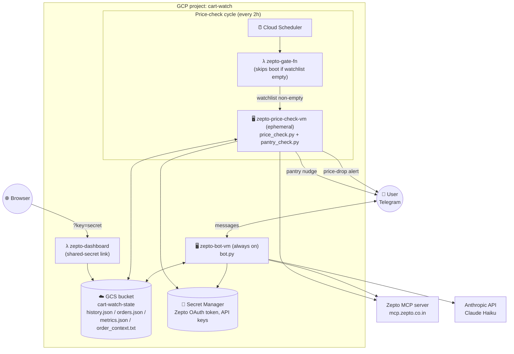
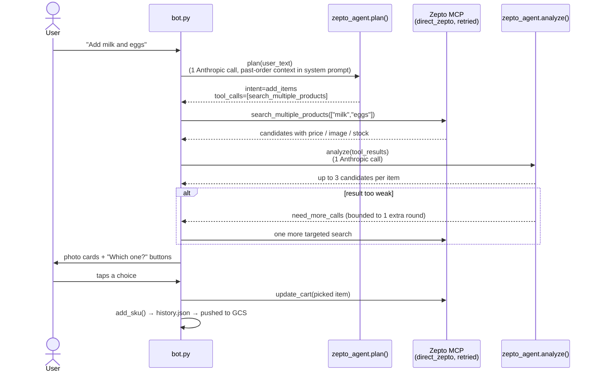
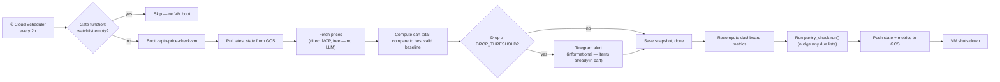

# Cart Watch: Zepto Grocery Watchlist Bot

A Telegram bot that watches your Zepto grocery cart, tells you when prices drop, and lets you add or remove items just by typing what you want in plain English. It also runs scheduled pantry restocks — nudging you at the cheapest point in the week to reorder your standing grocery list.

## What it does

- **Natural-language shopping** — text "Add Eggoz 30 egg tray, Amul milk 1L x2" and the bot searches Zepto, shows you photo cards of the actual matching products, and lets you tap the right one. Tapping a candidate adds it to both your watchlist and your real Zepto cart immediately.
- **Price-drop alerts** — a scheduled job checks your watchlist's prices every 2 hours (configurable) and messages you when the total drops by ₹50+ (configurable) versus the last time you saw the current basket at that price. Since your items already live in the Zepto cart, this is an informational nudge to go check out — you still place the order yourself in the Zepto app. This bot does **not** place orders autonomously.
- **Pantry Mode (recurring orders)** — define a named standing grocery list once; the bot nudges you on a schedule (weekly / biweekly / monthly), checks prices across each 2-hour cycle, and only fires the nudge when the cart total is at or near its historical low for that period. One tap loads all in-stock items into your real Zepto cart.
- **OOS substitution** — when a pantry item is out of stock, the bot suggests alternatives ranked by your past order history first (brands you've actually bought before), then by price. You can pre-approve a permanent substitute or type a custom search with optional price ceiling (e.g. "organic eggs under ₹200").
- **Cart removal by text** — "Remove milk from my cart" or "Clear my cart" resolves against your live Zepto cart and removes the matching items in one call.
- **Dashboard** — a Cloud Function serves a small metrics page (orders placed, total saved, alert conversion rate, price volatility per item) computed from your real Zepto order history.

## Architecture

The system is split into two Google Compute Engine VMs plus a couple of Cloud Functions, all coordinating through a shared GCS bucket for state.



### Components

| File | Role |
|---|---|
| `bot.py` | Telegram bot process (always running on `zepto-bot-vm`). Routes free text through `zepto_agent`, handles `/start /list /remove /status /pantry /done`, renders the photo picker, and adds picked candidates to the watchlist + real Zepto cart via `update_cart`. Also handles all pantry wizard steps and inline button callbacks. |
| `zepto_agent.py` | The core shopping pipeline (see below) — turns a free-text message into Zepto MCP calls and a structured result, with no unnecessary tool calls. |
| `direct_zepto.py` | Raw MCP client (`streamable_http` transport) that calls Zepto's MCP server directly — no LLM in the loop. Owns retry/backoff for rate limits (both in-response 429s and raw transport errors). |
| `zepto_mcp.py` | Older Anthropic-mediated MCP client (`mcp_servers` beta param). Now only used for `price_check.py`'s fallback path if `direct_zepto` is unavailable. |
| `pantry.py` | Pantry Mode data model — reads/writes `pantry_lists` inside `history.json` (GCS sync is automatic). Stores per-item `price_history[]`, computes `is_good_time_to_nudge()`, tracks nudge outcomes, and auto-pauses lists after 3 consecutive skips. |
| `pantry_check.py` | Pantry nudge engine — called from `price_check.run()` so it piggybacks on the existing Cloud Scheduler job. For each list in its nudge window: fetches prices, stores samples, waits for the cheapest window (or nudges at the 90% deadline), ranks OOS substitutes using `order_context.txt`, sends the Telegram nudge. |
| `build_order_context.py` | One-time/occasional script — paginates `list_order_history` (5s delay between pages) to build a list of your previously-ordered product names, so the planner can match "add milk" to the exact product you usually buy. |
| `watchlist.py` | Reads/writes `history.json` — tracked SKUs, price history per SKU, cart-total snapshots, alert log. |
| `price_check.py` | Runs once per invocation on `zepto-price-check-vm`. Fetches current prices, compares against the best valid historical baseline, sends a Telegram alert if the drop clears `DROP_THRESHOLD`, then calls `pantry_check.run()`. |
| `metrics.py` / `orders_sync.py` | Compute and cache the numbers behind the dashboard (orders, spend, savings, alert conversion, price volatility) from Zepto's real order history. |
| `gcs_sync.py` | Generic pull/push of local state files to/from the GCS bucket, so the ephemeral price-check VM and the always-on bot VM see the same state. |
| `zepto_auth.py` | Mints/refreshes the Zepto OAuth token from a stored refresh token (Secret Manager on GCP, local Claude Code credentials file for dev). |
| `config.py` | Local secrets/config (gitignored) — env vars take priority so the same file works unchanged on the VMs (values injected from Secret Manager) and locally. |

## How a shopping message is handled

The old design let Claude call Zepto's MCP tools autonomously inside one opaque Anthropic API call — our code never saw which tools ran or how many times, which made rate limits unpredictable. The current pipeline makes every Zepto call explicit and code-controlled:



Key properties:
- **1 search call per message**, not per item — `search_multiple_products` is used whenever 2+ items are mentioned, `search_products` for a single item.
- **No separate "get product details" call** — `search_products`/`search_multiple_products` already return `productVariantId`, `storeProductId`, price, image, and stock, so the picker is built straight from the search response.
- **At most one extra round-trip** (`MAX_EXTRA_ROUNDS = 1`) if the first search doesn't match well, instead of unbounded retries.
- Removing items (`"Remove milk from my cart"`, `"Clear my cart"`) follows the same plan → execute → analyze shape, but calls `view_cart` once and issues a single batched `update_cart(quantity=0)` call for every matched item, instead of one call per item.

## Price-check cycle



The gate function reads `history.json`'s `skus` list from GCS before booting the VM at all — an empty watchlist means the 2-hourly cycle is a no-op, so the VM doesn't spin up for nothing.

## Pantry Mode

Pantry Mode turns Cart-Watch into a habit engine for recurring grocery orders.

### Setup

```
User: /pantry new
Bot:  What do you want to call this list?
User: Weekly Grocery
Bot:  How often should I remind you?
      [Every week]  [Every 2 weeks]  [Every month]
User: [Every week]
Bot:  Which day and time?
      [Sunday 9 AM]  [Sunday 7 PM]  [Monday 9 AM]  [Custom]
User: [Sunday 9 AM]
Bot:  Got it! Now add your items — just type them naturally.
User: Amul Taaza 1L x3, Eggoz 30 egg tray, bread
Bot:  [photo pickers — same flow as regular shopping]
Bot:  ✅ Weekly Grocery set up with 3 items. Next nudge: Sun 17 Aug 09:00 AM IST
User: /done
```

### Nudge flow

Every 2-hour price check also evaluates pantry lists. When a list enters its nudge window (up to 24 hours around the scheduled day/time), the nudge fires only if the cart total is at or near its weekly low — otherwise it waits for a cheaper window. A hard deadline fires the nudge regardless of price at 90% of the cadence period.

```
Bot:  🛒 Weekly Grocery — time to restock!

      ✅ Amul Taaza 1L × 3 — ₹174
      ⚠️ Eggoz 30 egg tray — OUT OF STOCK
         → Eggs By Henfruit 30pk — ₹229 (ordered before)
      ✅ The Health Factory Whole Wheat Bread — ₹65

      Cart total (in-stock items): ₹239

      [✅ Load cart & order]  [✏️ Edit list]  [⏭ Skip this week]
      [🔍 Substitute for Eggoz 30 egg tray]
```

- **Load cart & order** — pushes all in-stock items (using any pre-approved substitutes for OOS items) to the live Zepto cart and records the outcome.
- **Substitute for X** — shows up to 3 suggestions ranked by order history match first, then price. Includes a "Type my own search" option that accepts a custom query with price ceiling (e.g. "cage free eggs under ₹250").
- **Skip** — records the skip; after 3 consecutive skips the list is auto-paused.

### OOS substitution ranking

1. Claude Haiku extracts a search query from the OOS item name, using your full `order_context.txt` order history as a system prompt — so it biases the query toward brands you've previously ordered (e.g. "Eggoz eggs" instead of generic "eggs").
2. Results are split into two buckets: previously-ordered brands (substring match against `order_context.txt`) and others.
3. Each bucket is sorted by price ascending (Zepto MCP does not expose ratings).
4. Top 3 combined (history-matched first) are shown.
5. Selecting a substitute asks "Save as permanent backup?" — yes stores it in `approved_substitute` on that pantry item so future nudges use it automatically without prompting.

### Commands

| Command | Behaviour |
|---|---|
| `/pantry` | Show all lists with status, item count, and next nudge time |
| `/pantry new` | Start the setup wizard |
| `/pantry edit <name>` | Add/remove items from a list |
| `/pantry pause <name>` | Pause nudges indefinitely |
| `/pantry resume <name>` | Resume a paused list |
| `/pantry delete <name>` | Delete a list (with confirmation prompt) |
| `/done` | Finish adding items during setup or edit |

## Tech stack

- **Language**: Python 3.11+, `asyncio` for the Zepto MCP pipeline
- **Bot**: `python-telegram-bot`
- **AI**: Anthropic Claude (Haiku) for planning/analysis and OOS category extraction — no LLM in the price-check path
- **Product data**: Zepto's own MCP server (`mcp.zepto.co.in`), via the `mcp` Python package
- **Infra**: GCP Compute Engine (2 VMs), Cloud Scheduler, Cloud Functions (gate + dashboard), Cloud Storage (shared state), Secret Manager (tokens/keys)

## Setup

See [SETUP.md](SETUP.md) for local setup instructions.

## Author

[Ruturaj](https://github.com/pruturaj16)

---

**Questions?** Open an issue or contact via Telegram (configure in `config.py`)
