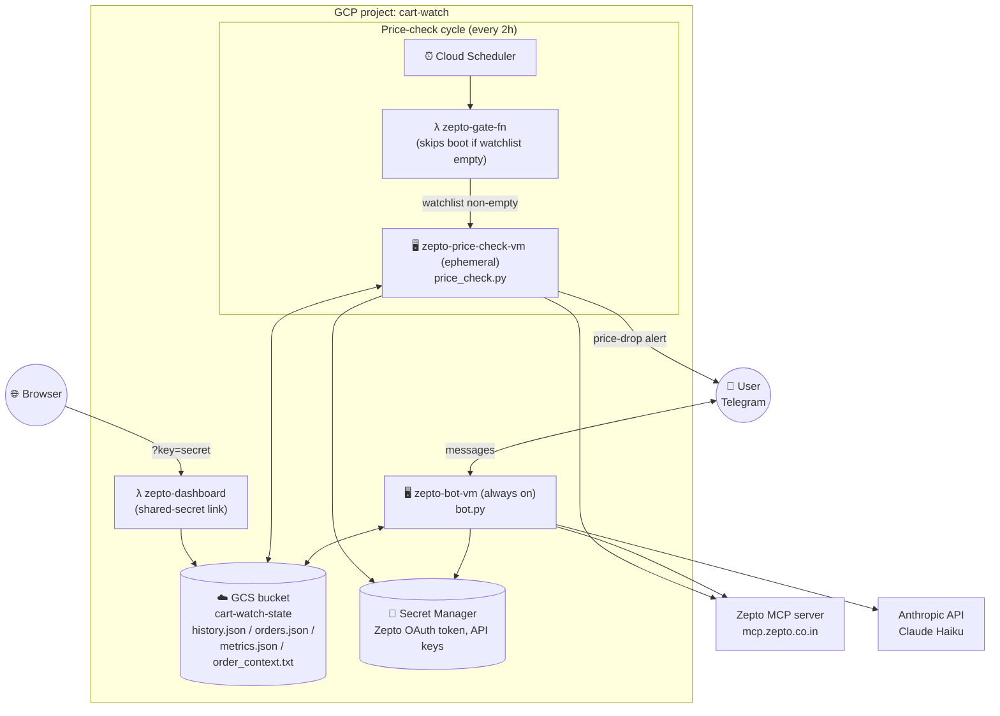
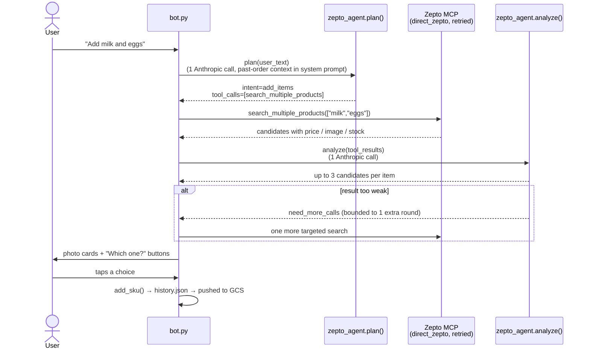
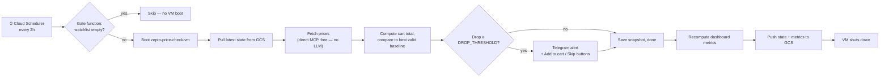

# Cart Watch: Zepto Grocery Watchlist Bot

A Telegram bot that watches your Zepto grocery cart, tells you when prices drop, and lets you add or remove items just by typing what you want in plain English.

## What it does

- **Natural-language shopping** — text "Add Eggoz 30 egg tray, Amul milk 1L x2" and the bot searches Zepto, shows you photo cards of the actual matching products, and lets you tap the right one before anything is added to your watchlist.
- **Price-drop alerts** — a scheduled job checks your watchlist's prices every 2 hours (configurable) and messages you when the total drops by ₹50+ (configurable) versus the last time you saw the current basket at that price.
- **One-tap cart add** — tapping "Add to cart" on an alert adds the discounted items to your real Zepto cart; you still place the order yourself in the Zepto app. This bot does **not** place orders autonomously.
- **Cart removal by text** — "Remove milk from my cart" or "Clear my cart" resolves against your live Zepto cart and removes the matching items in one call.
- **Dashboard** — a Cloud Function serves a small metrics page (orders placed, total saved, alert conversion rate, price volatility per item) computed from your real Zepto order history.

## Architecture

The system is split into two Google Compute Engine VMs plus a couple of Cloud Functions, all coordinating through a shared GCS bucket for state.

### Components

| File | Role |
|---|---|
| `bot.py` | Telegram bot process (always running on `zepto-bot-vm`). Routes free text through `zepto_agent`, handles `/start /list /remove /status`, renders the photo picker, and drives the price-alert Yes/Skip buttons. |
| `zepto_agent.py` | The core shopping pipeline (see below) — turns a free-text message into Zepto MCP calls and a structured result, with no unnecessary tool calls. |
| `direct_zepto.py` | Raw MCP client (`streamable_http` transport) that calls Zepto's MCP server directly — no LLM in the loop. Owns retry/backoff for rate limits (both in-response 429s and raw transport errors). |
| `zepto_mcp.py` | Older Anthropic-mediated MCP client (`mcp_servers` beta param). Now only used for the two flows not yet migrated: adding a watchlist item to the real cart after a price-drop alert, and `price_check.py`'s fallback path if `direct_zepto` is unavailable. |
| `build_order_context.py` | One-time/occasional script — paginates `list_order_history` (5s delay between pages) to build a list of your previously-ordered product names, so the planner can match "add milk" to the exact product you usually buy. |
| `watchlist.py` | Reads/writes `history.json` — tracked SKUs, price history per SKU, cart-total snapshots, alert log. |
| `price_check.py` | Runs once per invocation on `zepto-price-check-vm`. Fetches current prices, compares against the best valid historical baseline, sends a Telegram alert if the drop clears `DROP_THRESHOLD`. |
| `metrics.py` / `orders_sync.py` | Compute and cache the numbers behind the dashboard (orders, spend, savings, alert conversion, price volatility) from Zepto's real order history. |
| `gcs_sync.py` | Generic pull/push of local state files to/from the GCS bucket, so the ephemeral price-check VM and the always-on bot VM see the same state. |
| `zepto_auth.py` | Mints/refreshes the Zepto OAuth token from a stored refresh token (Secret Manager on GCP, local Claude Code credentials file for dev). |
| `config.py` | Local secrets/config (gitignored) — env vars take priority so the same file works unchanged on the VMs (values injected from Secret Manager) and locally. |

## How a shopping message is handled

The old design let Claude call Zepto's MCP tools autonomously inside one opaque Anthropic API call — our code never saw which tools ran or how many times, which made rate limits unpredictable. The current pipeline makes every Zepto call explicit and code-controlled:

Key properties:
- **1 search call per message**, not per item — `search_multiple_products` is used whenever 2+ items are mentioned, `search_products` for a single item.
- **No separate "get product details" call** — `search_products`/`search_multiple_products` already return `productVariantId`, `storeProductId`, price, image, and stock, so the picker is built straight from the search response.
- **At most one extra round-trip** (`MAX_EXTRA_ROUNDS = 1`) if the first search doesn't match well, instead of unbounded retries.
- Removing items (`"Remove milk from my cart"`, `"Clear my cart"`) follows the same plan → execute → analyze shape, but calls `view_cart` once and issues a single batched `update_cart(quantity=0)` call for every matched item, instead of one call per item.

## Price-check cycle

The gate function reads `history.json`'s `skus` list from GCS before booting the VM at all — an empty watchlist means the 2-hourly cycle is a no-op, so the VM doesn't spin up for nothing.

## Tech stack

- **Language**: Python 3.11+, `asyncio` for the Zepto MCP pipeline
- **Bot**: `python-telegram-bot`
- **AI**: Anthropic Claude (Haiku) for planning/analysis — no LLM in the price-check path
- **Product data**: Zepto's own MCP server (`mcp.zepto.co.in`), via the `mcp` Python package
- **Infra**: GCP Compute Engine (2 VMs), Cloud Scheduler, Cloud Functions (gate + dashboard), Cloud Storage (shared state), Secret Manager (tokens/keys)

## Setup

See [SETUP.md](SETUP.md) for local setup instructions.

## Author

[Ruturaj](https://github.com/pruturaj16)

---

**Questions?** Open an issue or contact via Telegram (configure in `config.py`)
